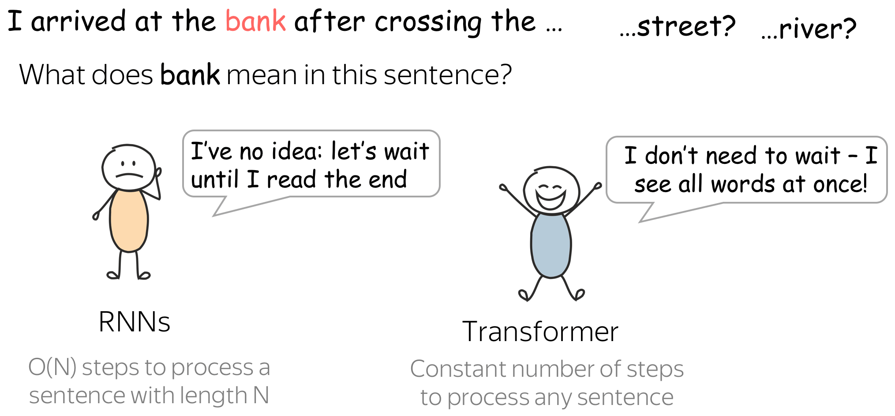
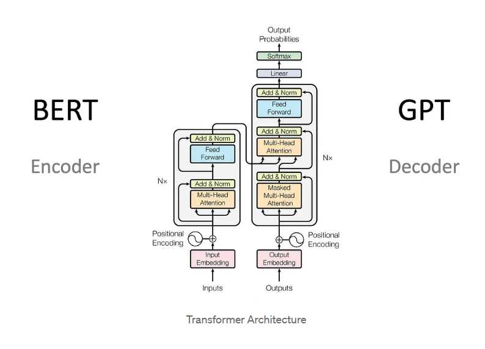
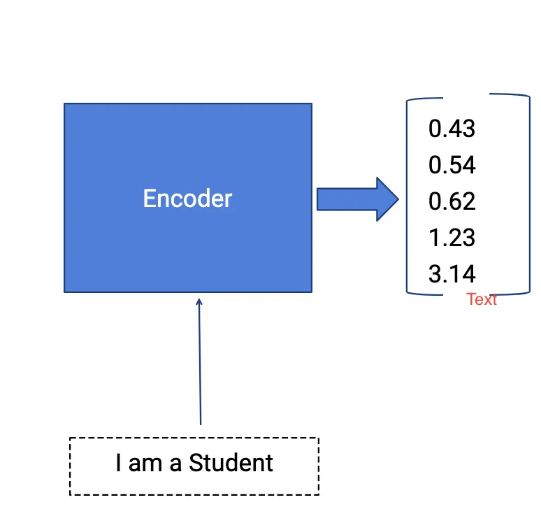
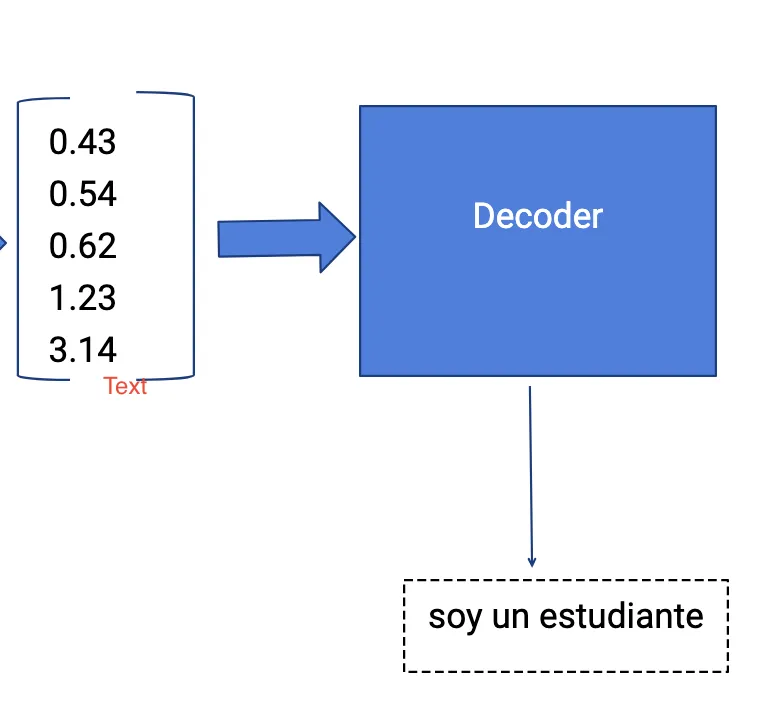
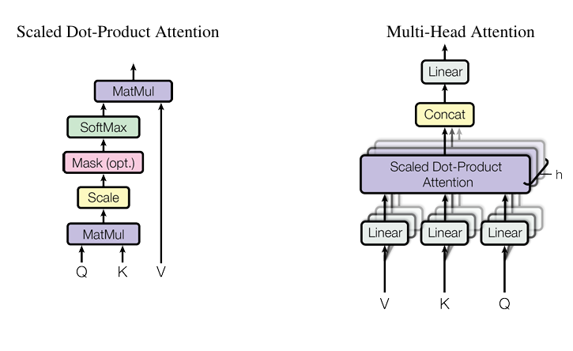
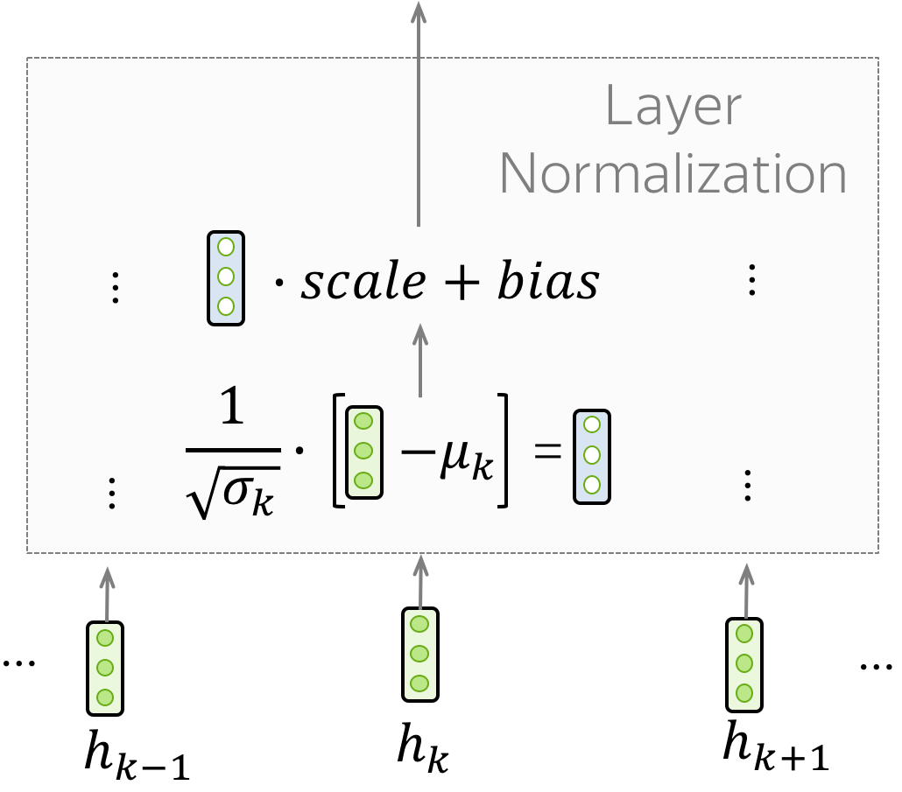

# Attention Is All You Need

**Author:** Atul Kumar Kanojia  
**Date:** February 16, 2025

---

## Understanding the Transformer: A Pre-Introduction

Before the introduction of the Transformer, **sequence-to-sequence (seq2seq) models** were the standard for tasks like machine translation, speech recognition, and text generation. These models, primarily based on **Recurrent Neural Networks (RNNs)**, consisted of two main components:

- **Encoder** – Processes the input sequence step by step, capturing its meaning into a fixed-length context vector.
- **Decoder** – Generates the output sequence by using the context vector as a reference while predicting each word sequentially.

### The Evolution of Seq2Seq Models

A major enhancement to this was the introduction of **Long Short-Term Memory (LSTM)** and **Gated Recurrent Units (GRU)**, which helped mitigate the vanishing gradient problem, allowing for better learning of long-range dependencies.

Despite their success, RNN-based seq2seq models had significant drawbacks:

- **Bottleneck Effect:** Encoding the entire input into a single fixed-size vector limited the model's ability to retain long-term dependencies.
- **Slow Training & Inference:** Due to their sequential nature, RNNs processed words one at a time, making training and inference time-consuming.
- **Difficulty in Parallelization:** Since each state depends on the previous one, RNNs couldn't leverage parallel computing efficiently.
- **Gradient Issues:** Even with LSTMs and GRUs, long-range dependencies could still be difficult to capture.

These limitations paved the way for **attention mechanisms**, which allowed models to focus on relevant parts of the input at each step.

### Enter the Transformer

The **Transformer model** fully replaced recurrence with **self-attention**, significantly improving efficiency and performance. By removing the need for sequential processing, Transformers enabled:

✅ **Faster training** – Thanks to parallelization, Transformers train significantly faster than RNNs.  
✅ **Better long-range dependency handling** – Attention mechanisms help the model focus on important parts of the input.  
✅ **Scalability** – The model can handle larger datasets efficiently.

A special thanks to **3Blue1Brown** and **Jay Alammar** for their incredible contributions in making these concepts more accessible!

With a foundational understanding of **sequence-to-sequence** models and their limitations, we now turn our focus to the **Transformer**—a groundbreaking model that redefined sequence learning. In this section, we will analyze the original research paper, exploring its key innovations, architecture, and impact on the field.

---

## Introduction

**RNNs, LSTMs, and Gated RNNs** are still significant achievements in Machine Learning.

A recurrent model processes sequences by maintaining a record of symbol positions in input and output states, denoted as _hₜ_, which is a function of the previous hidden state _hₜ₋₁_ and the input at time _t_.

In an **RNN**, each token (word) is processed sequentially, one after another. This prevents **parallelization** within training examples, making it difficult to handle long sequences efficiently. The longer the sequence, the more time it takes to compute due to its **sequential nature**.

#### Memory Constraints

**GPU/TPU limitations:** These hardware accelerators have limited RAM. Since training involves processing multiple examples simultaneously to speed up learning, memory usage increases significantly due to batching constraints.

#### Attention Mechanisms

Attention mechanisms play a crucial role in sequence modeling and transduction tasks. They enable models to capture dependencies without being constrained by the position of input and output sequences.

Attention mechanisms are often used alongside **Recurrent Neural Networks (RNNs)** to enhance their ability to process long-range dependencies more effectively.

### Transformer

The Transformer is a model that leverages attention mechanisms to significantly speed up Machine Learning training.

Unlike traditional models, it **eliminates recurrence** and relies entirely on **self-attention** to capture global dependencies between input and output sequences.

This approach enhances **parallelization**, improves **translation quality**, and achieves remarkable performance—all while requiring only **eight hours of training**.

---

## Background

Reducing sequential computations has led to advancements in models like **Extended Neural GPU**, **ByteNet**, and **ConvS2S**, all of which utilize **convolutions**. However, as the distance between input and output increases, it becomes challenging to learn dependencies between different positions.

In a **Transformer**, the number of steps required to relate two distant tokens remains **constant**. Since it uses **Self-Attention**, each token's representation is computed as a **weighted sum** of all other tokens:

$$
\text{Attention}(Q, K, V) = \text{softmax} \left( \frac{QK^T}{\sqrt{d_k}} \right) V
$$

where:

- $Q$ (Query), $K$ (Key), and $V$ (Value) are transformed representations of input tokens.  
- $d_k$ is the dimensionality of the key vectors.  
- The **softmax** function ensures attention scores sum to 1.  

A potential drawback of this **averaging effect** is the loss of fine-grained details in token representations.

To counter this, **Multi-Head Attention** is introduced:

- Instead of using a **single** attention mechanism, **multiple attention heads** operate in parallel.
- Each head captures **different aspects** of relationships between tokens, preserving more contextual information.
- This enhances the **model’s ability** to learn diverse patterns while maintaining the efficiency of self-attention.

---

## Architecture

Most models use an **Encoder-Decoder** structure.

- The **Encoder** maps an input sequence of symbol representations $(x_1, x_2, \dots, x_n)$ to a sequence of continuous representations:  
  $$ z = (z_1, z_2, \dots, z_n) $$  
- The **Decoder** generates an output sequence $(y_1, y_2, \dots, y_m)$ one element at a time, based on the encoded representation.
- Linear and Softmax Layers

### Linear Transformation  
The **Linear** layer is a fully connected layer that applies a weight matrix $W$ and a bias $b$ to transform the input:  
$$ \text{Linear}(x) = Wx + b $$  
This transformation projects data into a different feature space, preparing it for further computations.

### Softmax Activation  
The **Softmax** function converts logits (raw output values) into probabilities, ensuring they sum to 1:  
$$ \text{Softmax}(z_i) = \frac{e^{z_i}}{\sum_{j} e^{z_j}} $$  
This is crucial for classification tasks, as it assigns probabilities to different output classes.

---

## Encoder and Decoder Stacks

### Encoder:
Composed of **6 identical layers**.

Each layer has **two sub-layers**:

- Multi-head self-attention (captures dependencies across the sequence).
- Feed-forward network (applies transformations position-wise).

Uses residual connections (preserves information flow) followed by layer normalization.
All layers, including embeddings, have a fixed dimension of 512 for consistency.

### Decoder:
Also 6 identical layers, with an additional third sub-layer per layer:
- This multi-head attention layer attends to the encoder’s output.

Like the encoder, it has residual connections and layer normalization.

Uses masked self-attention, ensuring that predictions for position i only depend on known outputs before i (prevents cheating during training).

___

## Attention

An **attention function** maps a query and a set of key-value pairs to an output, where all elements are vectors.

- The output is a **weighted sum** of the values.
- The weights are determined by a **compatibility function**, which measures how well the query matches each key.
- This mechanism allows the model to focus on the most relevant parts of the input while computing the output.

___

### Scaled Dot-Product Attention

The inputs consist of:
- Queries **Q** and Keys **K**, both of dimension $d_k$
- Values **V**, of dimension $d_v$

The attention mechanism computes the dot product of **Q** and **K**, scales it by $\sqrt{d_k}$, applies a **softmax** function to obtain attention weights, and then multiplies these weights with **V**:

$$
\text{Attention}(Q, K, V) = \text{softmax} \left( \frac{QK^T}{\sqrt{d_k}} \right) V
$$

This scaling factor $\sqrt{d_k}$ helps maintain stable gradients, preventing extremely large or small values in the softmax function.

___

### Multi-Head Attention

Instead of applying a single attention function to queries, keys, and values of dimension $d_{\text{model}}$, it is beneficial to **project** them into lower-dimensional spaces multiple times.  

- The model **linearly projects** the queries, keys, and values **$h$ times** using different learned weight matrices into dimensions $d_k$, $d_q$, and $d_v$.
- The **attention function** is then applied in parallel to each of these projected versions, producing $d_v$-dimensional output values.
- These outputs are **concatenated** and projected again, yielding the final output.

The multi-head attention mechanism is defined as:

$$
\text{MultiHead}(Q, K, V) = \text{concat}(\text{head}_1, \dots, \text{head}_h) W^O
$$

where each head is computed as:

$$
\text{head}_i = \text{Attention}(Q W_i^Q, K W_i^K, V W_i^V)
$$

This mechanism allows the model to **capture multiple types of relationships** in the data by attending to different parts of the input sequence simultaneously.

___

### Application of Attention in This Model

The Transformer model utilizes **multi-head attention** in three key ways:

#### Encoder-Decoder Attention
- Queries ($Q$) come from the **previous decoder layer**.
- Keys ($K$) and Values ($V$) come from the **encoder output**.
- This mechanism allows the **decoder to attend to all positions** in the input sequence, similar to traditional **encoder-decoder attention** in sequence-to-sequence (Seq2Seq) models.

#### Self-Attention in the Encoder
- Queries ($Q$), Keys ($K$), and Values ($V$) **all come from the encoder's previous layer output**.
- This enables each position in the encoder to **attend to all other positions** in the input sequence, capturing global dependencies.

#### Self-Attention in the Decoder
- Each position in the decoder **attends to all previous positions, including itself**.
- To prevent **information leakage**, a **masking mechanism** is applied in the scaled dot-product attention:
  - Future connections are set to **$-\infty$** before applying the **softmax** function.
  - Mathematically, this ensures that for any position $i$, attention is only computed for positions **$\leq i$**.

- This masking mechanism maintains the **auto-regressive property**, ensuring that predictions for position $i$ depend **only on known outputs before $i$**.

Before moving ahead towards FFN let's see a well labeled diagram of transformer model:

---

### Feed-Forward Network (FFN) in Transformer

Each layer in both the **encoder** and **decoder** includes a **fully connected feed-forward network (FFN)**, which is applied **independently** at each position.

#### Structure of the FFN

The **feed-forward network (FFN)** consists of **two linear transformations** with a **ReLU activation** in between:

$$
\text{FFN}(x) = \max(0, x W_1 + b_1) W_2 + b_2
$$

- The **same function** is applied **separately** to each position in the sequence.

#### Key Properties

- The **linear transformations** are identical **across all positions** but **differ across layers**.
- This can be interpreted as applying **two $1 \times 1$ convolutions** in CNN terminology.

#### Dimensionality

- **Input & Output Dimension**: $d_{\text{model}} = 512$
- **Inner Layer Dimension**: $d_{\text{ff}} = 2048$

The **FFN component** introduces **non-linearity and transformation** beyond self-attention, enriching the feature representation.

### Residual Connections

 Residual connections are very simple (add a block's input to its output), but at the same time are very useful: they ease the gradient flow through a network and allow stacking a lot of layers.

In the Transformer, residual connections are used after each attention and FFN block. On the illustration above, residuals are shown as arrows coming around a block to the yellow "Add & Norm" layer. In the "Add & Norm" part, the "Add" part stands for the residual connection.

***

### Layer Normalization

The **"Norm"** part in the **"Add & Norm"** layer refers to **Layer Normalization**. It **independently normalizes** the vector representation of each example in a batch—this helps control the **flow** of information to the next layer. **Layer normalization** improves **convergence stability** and sometimes even **model quality**.

#### How Layer Normalization Works

In a **Transformer**, we normalize the **vector representation of each token**. Additionally, **LayerNorm** has **trainable parameters**, **scale** and **bias**, which are applied **after normalization** to rescale the layer's outputs (or the next layer's inputs).

Mathematically, for an input **$x$** with **$d_{\text{model}}$** dimensions, layer normalization is defined as:

$$
\hat{x}_k = \frac{x_k - \mu_k}{\sigma_k}, \quad y_k = \gamma \hat{x}_k + \beta
$$

where:

- **$x_k$** is the input feature at index **$k$**.
- **$\mu_k$** and **$\sigma_k$** are the **mean** and **standard deviation**, computed across all features **for each input example**.
- **$\gamma$ (scale) and $\beta$ (bias)** are **learnable parameters**, shared across all input examples but **different for each layer**.

#### Key Properties

- **Normalization is applied per input example**, ensuring stable training.
- **Scale ($\gamma$) and bias ($\beta$) are trainable**, allowing the model to **recover** information lost during normalization.
- **LayerNorm differs from BatchNorm** because it does **not** compute statistics across the batch but instead operates **independently for each input example**.

***

### Embeddings and Softmax

#### Token Embeddings

- **Input and output tokens** are mapped to **vectors** of dimension **$d_{\text{model}}$** using **learned embeddings**.

#### Output Prediction

- The **decoder output** undergoes a **learned linear transformation** followed by a **softmax function** to generate **next-token probabilities**.

#### Weight Sharing

The **same weight matrix** is shared between:
1. **Input embeddings**
2. **Output embeddings**
3. **Pre-softmax transformation**

This technique is inspired by **previous models** [30].

#### Scaling Factor

- In **embedding layers**, the weights are **scaled** by **$\sqrt{d_{\text{model}}}$** to **stabilize training**.

This approach ensures:
- **Efficient parameter usage**
- **Effective token representation**
- **Better prediction accuracy**

___ 

### Positional Encoding

#### Purpose

Since the Transformer **lacks recurrence and convolution**, **positional encodings** are added to embeddings to **capture sequence order**.

#### Implementation

- The **positional encoding** has the **same dimension** as the embeddings **($d_{\text{model}}$)** and is **summed** with them.
- It is computed using **sine and cosine functions** at different frequencies:

$$
PE(pos, 2i) = \sin\left(\frac{pos}{10000^{\frac{2i}{d_{\text{model}}}}}\right)
$$

$$
PE(pos, 2i+1) = \cos\left(\frac{pos}{10000^{\frac{2i}{d_{\text{model}}}}}\right)
$$

- This ensures **each dimension** follows a **sinusoidal pattern**, enabling the model to **learn relative positions efficiently**.

#### Alternative Approach

- **Learned positional embeddings** were tested but produced results **similar** to sinusoidal encoding.
- **Sinusoidal encoding** was preferred as it helps the model **generalize** to **longer sequences** than those seen during training.

***

## Why Use Self-Attention?

Self-attention is preferred over recurrent and convolutional layers for sequence-to-sequence tasks due to three key advantages:

### 1. Computational Complexity

Self-attention has a complexity of $O(n^2 \cdot d)$ but is faster than recurrent layers when the sequence length $n$ is smaller than the representation dimension $d$, which is common in NLP tasks.  

- Convolutional layers are typically more expensive than recurrent layers, requiring multiple stacked layers to connect all positions.

### 2. Parallelization

- Self-attention processes all positions **in parallel** with a constant number of sequential operations, i.e., $O(1)$, unlike recurrent layers that require $O(n)$ sequential steps.
- Convolutions require $O(n/k)$ layers for full connectivity or $O(\log_k n)$ with **dilated convolutions**, making them less efficient than self-attention.

### 3. Learning Long-Range Dependencies

- Self-attention **connects all positions directly**, enabling efficient learning of long-range dependencies.
- Recurrent layers have longer paths, i.e., $O(n)$, making dependency learning harder.
- Convolutions need stacking for full connectivity, increasing **path length** and complexity.

### Other Benefits of Self-Attention:
- Can be restricted to a local neighborhood of size $r$, reducing **path length** to $O(n/r)$ for long sequences.
- Enables **more interpretable models**, as different attention heads capture syntactic and semantic relationships in sentences.

---

## Training Regime of the Transformer Model

### 1. Training Data and Batching
- **English-German**: Used the WMT 2014 dataset (~4.5M sentence pairs), encoded with **byte-pair encoding (BPE)**, resulting in a shared vocabulary of approximately **37,000 tokens**.
- **English-French**: Used a larger WMT 2014 dataset (**36M sentences**) with a **word-piece vocabulary** of **32,000 tokens**.
- **Batching**: Sentence pairs were grouped by length, with each batch containing **~25,000 source and target tokens**.

### 2. Hardware and Training Schedule
- **Base Model**:
  - Trained on **8 NVIDIA P100 GPUs**.
  - Each step took **0.4 seconds**.
  - Total training time: **100,000 steps (~12 hours)**.
- **Big Model**:
  - Step time: **1 second**.
  - Total training time: **300,000 steps (~3.5 days)**.

### 3. Optimizer and Learning Rate
- Used the **Adam optimizer** with the following parameters:
  - $\beta_1 = 0.9$, $\beta_2 = 0.98$, $\epsilon = 10^{-9}$.
- **Learning Rate Schedule**:
  - The learning rate **increases linearly** for the first **4,000 warm-up steps**.
  - After warm-up, it **decreases proportionally** to the inverse square root of the step number:
    $$
    \text{lr} = d_{\text{model}}^{-0.5} \cdot \min(\text{step}^{-0.5}, \text{step} \cdot \text{warmup}^{-1.5})
    $$

### 4. Regularization Techniques
- **Residual Dropout**:
  - Applied **dropout ($P = 0.1$)** in **sub-layers**, **embedding sums**, and **positional encodings**.
- **Label Smoothing**:
  - Applied $\epsilon = 0.1$, which slightly **reduces perplexity** but **improves BLEU score and accuracy**.

These optimizations helped the Transformer achieve **state-of-the-art BLEU scores** while maintaining **lower training costs** compared to previous models.

---

## Results

1. On the **WMT 2014 English-to-German** translation task, the Transformer outperformed previous models (ByteNet, ConvS2S) by **2.0+ BLEU**, achieving a score of **28.4 BLEU**.
2. On the **WMT 2014 English-to-French** translation task, the Transformer achieved **41.0 BLEU**, surpassing all previous models at just **1/4th of the training cost**.

---

## Conclusion

This work introduced the **Transformer**, the first sequence transduction model based entirely on  
attention, replacing recurrent layers commonly used in encoder-decoder architectures with  
multi-headed self-attention.  

The **Transformer** can be trained **significantly faster** than architectures based on recurrent or convolutional layers.  
On both the **WMT 2014 English-to-German** and **WMT 2014 English-to-French** translation tasks, it achieved a **new state-of-the-art**.  

Transformers are shaping the future of AI, offering **breakthrough performance** across various domains, including:
- **Computer Vision**
- **Natural Language Processing (NLP)**
- **Reinforcement Learning**

With their ability to **model long-range dependencies** and process large datasets efficiently, Transformers have revolutionized tasks such as:
- **Image recognition**
- **Text generation**
- **Speech processing**  

By **eliminating recurrence**, they enable **parallel processing**, making training **faster** and **more scalable**. Their impact extends across multiple industries, including **healthcare, finance, and beyond**.
